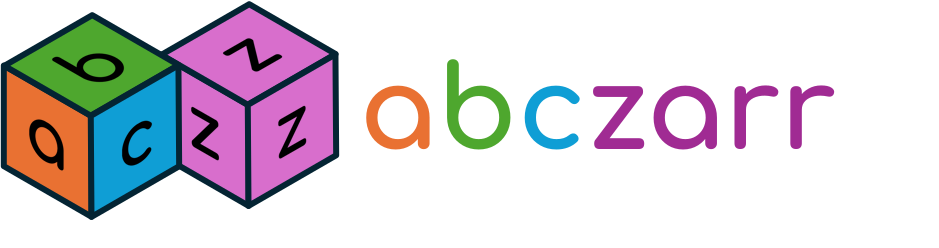

# abczarr



One interface for reading and writing Zarr arrays and groups -- sync or
async -- no matter which backend or storage location holds them.

> [!WARNING]
> **Status:** pre-release -- under active development, not ready for use yet.

## What it does

abczarr gives you a single, uniform API for Zarr -- `ZarrArray` and
`ZarrGroup`, in both a synchronous and an asynchronous flavour. Write your
code against that surface once, and swap what's underneath without touching
it:

- **One API, sync or async.** Write against `ZarrArray` / `ZarrGroup` once;
  every node has an `await`-able twin -- native where the backend offers
  async I/O, transparently threaded where it doesn't.
- **Three interchangeable drivers, auto-selected.** zarr-python, tensorstore
  and zarrista sit behind the same interface. Name one explicitly, or let
  abczarr pick the one that supports what an array actually needs. Local
  paths and cloud URLs (`s3://`, `gs://`, ...) work out of the box.
- **Honest about what works.** Ask a driver what it supports -- and whether
  that support is native to the backend or synthesized from simpler
  operations -- before you rely on it. When something genuinely isn't
  supported, the error names the missing feature instead of failing deep in
  a backend's internals.
- **Typed, versioned metadata with conversion.** One frozen, validated model
  spans Zarr v1, v2 and v3 and converts between them -- keeping equivalent
  options where the target format allows, and telling you what it drops when
  it can't (`lossy`, `warn` or `strict`).
- **OME-Zarr, first class.** The versioned OME-NGFF metadata gets the same
  typed model, offline JSON-Schema validation, and cross-version conversion
  as the core Zarr metadata.

```python
from abczarr.api import open

# any backend, any location -- the driver is chosen for what the array needs
group = open("s3://my-bucket/dataset.zarr")
array = group["images"]
data = array[:100, :100]

# the same call is await-able -- native async where the backend provides it
agroup = await open("s3://my-bucket/dataset.zarr", asynchronous=True)
aimages = await agroup.getitem("images")
tile = await aimages.getitem((slice(100), slice(100)))
```

## Learn more

Full documentation lives at
[neuroscales.github.io/abczarr](https://neuroscales.github.io/abczarr/).

abczarr is part of the **bagof** ecosystem of small, focused packages --
see [bagof-paths](https://github.com/bagofseeds/bagof-paths) for the
storage layer and [bagof-magic](https://github.com/bagofseeds/bagof-magic)
for the type-hint-driven data classes abczarr's metadata model is built on.
